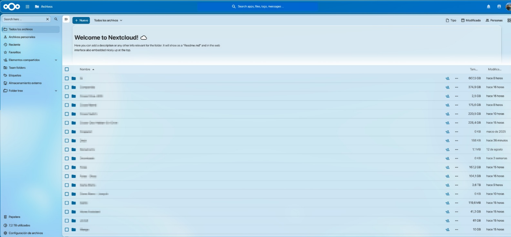
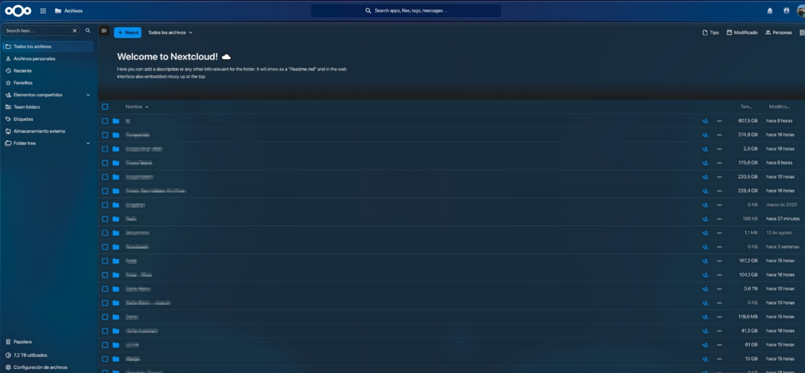

# Aurastrata



A custom CSS theme for **Nextcloud 34**, inspired by:
- Microsoft Windows Vista's theme
- Microsoft Windows 7's theme
- Apple's Liquid Glass design
- Nextcloud 34's default theme

## Features

* Floating translucent top bar.
* Glass-style panels, menus, dialogs, and cards.
* Colors derived automatically from Nextcloud's primary theme color.
* Light and dark mode support.
* Preserves Nextcloud's high-contrast mode.
* Supports `prefers-reduced-transparency`.
* Additional styling for Files, Notes, Deck, menus, popovers, dialogs, and other interface elements.

## Installation

1. Install and enable the **[Custom CSS](https://apps.nextcloud.com/apps/theming_customcss)** app or run the commands:

```bash
occ app:install theming_customcss
occ app:enable theming_customcss
```

... in your Nextcloud instance.

2. Log in as an administrator and go to:

   **Administration settings -> Theming -> Custom CSS**

3. Copy the contents of the **[CSS](aurastrata-nextcloud34.css)** in this repository content into the **[Custom CSS](https://apps.nextcloud.com/apps/theming_customcss)** field and save the changes.

## Compatibility

Designed for **Nextcloud 34**.

## Screenshots

### Light theme


### Dark theme


